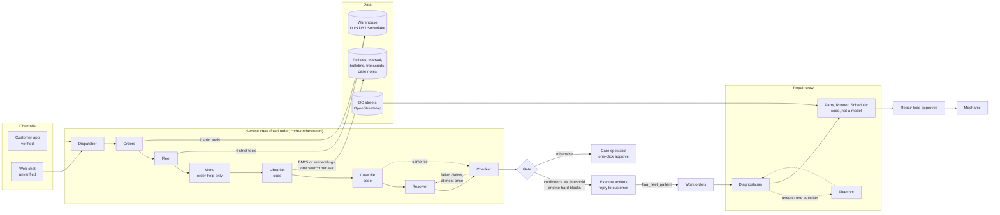

# SliceBot

**A multi-agent customer-service system for a robot pizza company, with people in the loop and an eval that proves the numbers.**


SliceBot is a fictional company that delivers pizza with sidewalk robots on the real streets of
**Capitol Hill and Navy Yard in Washington, DC**. Its service crew of seven bots answers account
questions, ticket status, and product questions. The bots combine **structured data** (orders,
payments, robot telemetry, inventory, in a DuckDB warehouse standing in for Snowflake) with
**unstructured data** (policies, a service manual, ops bulletins, past chat transcripts, and
technician case notes).

It is built to show the parts that matter in a real deployment: **scoping, KPIs, guardrails,
people in the loop, and an eval that proves the numbers.** You can also watch the agents work. On
the **Agent Floor**, the bots talk to each other in a group chat while the robots they mention
light up on a 3D map of DC.

> The streets, buildings, landmarks, and weather are real (from OpenStreetMap and Open-Meteo,
> saved in the repo). The company, customers, robots, orders, and documents are fictional and
> come from a seeded script. There is no real customer data, brand, or client code.

### Highlights

- **Seven bots in a fixed, code-orchestrated workflow:** Dispatcher → Orders → Fleet → Menu →
  Librarian → Resolver → Checker. Each one's real structured output appears in a live crew channel.
- **Confidence is computed, not self-reported.** A threshold slider is the one lever that trades
  containment against accuracy.
- **Guardrails live in code.** PII masking, ownership checks on every tool, a $20 auto-refund cap,
  and hard rules that can only push a case toward a person.
- **Two bounded self-correction loops:** the Checker sends a draft back to the Resolver once, and
  the Diagnostician asks the Fleet bot one question when it's unsure.
- **A second crew turns complaints into repairs.** A pattern spotted in customer complaints becomes
  work orders, then a repair plan that respects shifts, stock, and the dinner rush, then a
  mechanic's queue.
- **A 61-case graded eval** with a threshold sweep. On the offline rules engine: 100% escalation
  recall, 100% grounded claims, and 0 safety violations.
- **Three engines:** Claude, a deterministic rules engine (free, offline), and Replay of recorded
  Claude runs (no network).

---

## Contents

- [Quick start](#quick-start)
- [The 60-second version](#the-60-second-version)
- [Five people, one workflow](#five-people-one-workflow)
- [The Agent Floor](#the-agent-floor)
- [The copilot](#the-copilot)
- [Architecture](#architecture)
- [Design choices worth defending](#design-choices-worth-defending)
- [Evals and KPIs](#evals-and-kpis)
- [What is real and what is simulated](#what-is-real-and-what-is-simulated)
- [Where the data comes from](#where-the-data-comes-from)
- [Configuration](#configuration)
- [Tech stack](#tech-stack)
- [Repo map](#repo-map)
- [Further reading](#further-reading)

---

## Quick start

You need **Python 3.11+** and **Node 18+**. No API key is required.

```bash
git clone https://github.com/ndora95/slice-bot.git
cd slice-bot
./setup.sh      # once: Python venv, front-end build, demo data, offline eval
./run.sh        # → http://127.0.0.1:8787
```

On Windows, run `setup.bat`, then `run.bat`.

Open the console, pick a person on **Sign in as**, and go to the **Agent Floor**. Pick a story and
press **Run it live**.

### Engines

| Engine | When | Cost | Network |
|---|---|---|---|
| **Rules** | Default when no key is set, or `SLICEBOT_ENGINE=offline` | Free | None |
| **Claude** | `ANTHROPIC_API_KEY` is set | Roughly $0.10–0.30 a case (61-case eval ≈ $6–18) | Yes |
| **Replay** | Recorded Claude runs from `backend/recordings/` | Free | None |

The header shows which engine is running. To run on Claude:

```bash
cp .env.example .env          # add ANTHROPIC_API_KEY=...
./run.sh
cd backend && .venv/bin/python -m slicebot.smoke   # hero stories on Claude, ~$1, saves Replay recordings
```

Replay plays the same streams back without a network, so the demo still works if the Wi-Fi fails.
**Reset demo** in the header rebuilds all data from the seed in under two seconds.

### Tests and evals

```bash
cd backend
.venv/bin/python -m pytest                              # guardrails, stories, both loops, scheduler, eval floor
.venv/bin/python -m slicebot.evals.run --engine offline # the full 61-case test set, free
.venv/bin/python -m slicebot.evals.run --engine live    # the same set on Claude (costs money)
cd ../frontend && npm run verify-ui                     # UI design-system conformance check
```

---

## The 60-second version

1. Priya, in Navy Yard, writes in: *"My pizza arrived cold."*
2. The **service crew** works the case in a fixed order. Each bot posts what it found and hands
   the case to the next one by name (`@Fleet check the robot that carried it`):

   | Bot | Job | Touches |
   |---|---|---|
   | Dispatcher | What is this about, who is needed, any red flags | the message |
   | Orders | Customer, order, payments, tickets | warehouse, through 7 fixed tools |
   | Fleet | Robot telemetry, warming-box record, fleet-wide pattern scan | warehouse, through 4 fixed tools |
   | Menu | Joins only for order help: builds an order that meets every allergy and diet | the menu, in code |
   | Librarian | The policy, manual, and bulletin passages that apply, with exact quotes, at least one per ask | document search, in code (no model) |
   | Resolver | The reply, with every claim tied to a source, plus proposed actions | the case file only |
   | Checker | Verifies each claim and quote, enforces policy, scores confidence | the case file; code first, model second |

   Between the lookups and the Resolver, code (not a model) assembles the **case file**. It is one
   Markdown document with the customer's asks, every warehouse fact and policy passage under its
   source ID, the limits that apply, and the other bots' notes. The Resolver writes from it and the
   Checker checks against it. When a case is handed off, it becomes the specialist's brief in the
   Case Room.

   If a claim fails, the Checker sends the draft back to the Resolver **once**. The revision may
   change only the reply and the claims; the actions stay frozen from the first draft.

3. If confidence is above the Head of Care's threshold and there are no hard blocks, the reply is
   sent and the actions run (here, a $17.50 refund). Otherwise the case goes to the
   **Care specialist** with a handoff they can approve in one click.
4. The Fleet bot noticed the same heat loss on three more robots from batch M2-B07, so the case
   opens **four work orders**, and the **repair crew** picks them up in the same channel. The
   Diagnostician is 88% sure it's the lid seal, so it **asks the Fleet bot** whether the box
   reaches temperature before it leaves the Hub (the manual's test for seal vs heater). Fleet
   answers from the delivery records, and the Diagnostician settles at 96%. Parts, Runner, and
   Scheduler fit all four repairs in before the dinner rush, and robot SB-008 carries the gaskets
   from the Hub.
5. The **Repair lead** approves the plan. The jobs land in the **Mechanic's** queue with the part
   and bin reserved, and the runner's route appears on the map.
6. The **KPI Cockpit** shows containment, accuracy, escalation recall, grounded claims, and safety
   violations from the test set. It also has the **threshold slider**, the one design lever that
   trades containment against accuracy.

The crew **works the inbox on its own**. When the console opens (and after Reset demo), the crew
works every contact nobody has run yet in the background, oldest first. People open on a worked
queue where only the handoffs need them.

---

## Five people, one workflow

The console opens on **Sign in as**. Each person sees only the part that needs a human decision;
the bots do the rest.

| Person | Sees | Decides |
|---|---|---|
| Maya Chen, customer | My Order: her order, the robot, credits, the help chat | Nothing. She gets answers. |
| Dana Kim, Care specialist | Agent Floor, Case Room (her inbox), Live City | Handoffs: refunds over $20, legal, safety |
| Renee Alvarez, Head of Care | KPI Cockpit, Agent Floor, Case Room, Live City | The confidence threshold |
| Imani Wright, Repair lead | Repair Queue, Schedule, Warehouse, Live City | Approves the repair crew's plans |
| Lena Fischer, mechanic | My Jobs, Live City | Starts a job, marks it fixed |

```
Customer -> Service crew (bots) -> Confidence gate (code) -> Care specialist (only if needed)
                                         |
                    Fleet bot opens work orders -> Repair crew (bots) -> Repair lead -> Mechanic
```

Every case has a **journey strip** (on the Agent Floor and in the Case Room). It shows each hand
the case passed through, labelled Customer, Bots (rules or Claude), Code, or Person, and what is
still waiting. Deep links keep one browser tab per person, for example
`/?as=specialist&tab=floor&case=K-9003`.

---

## The Agent Floor

This is the view to open the demo on. Pick a story and press **Run it live**:

| Case | Story |
|---|---|
| K-9003 Priya | Cold pizza becomes a fleet fix: both loops run, four robots light up, and the repair plan is approved |
| K-9001 Maya | Robot stalled on the way; a backup robot is sent, $5 credit, new ETA 14:03 |
| K-9008 Omar | The Checker sends a draft back: a $19.50 refund that no source states is itemized on draft 2 |
| K-9004 Marcus | An $84.60 refund is over the $20 limit, so the Care specialist approves it |

**Left: the crew channel.** Each message is the bot's real structured output: what it said, the
tools it called, and who it handed the case to and with what. **Raw output** under any message
shows the JSON. Code builds the `@` handoffs from that output (`handoffs.py`), because the order
of bots is fixed in code rather than decided by a model. Nothing is written for show.

**Right: the DC map.** Robots the conversation mentions light up, the customer's message is pinned
over their home, and approved plans add the runner's route.

## The copilot

Every persona has a pizza in the bottom-right corner (or press ⌘J). It opens **SliceBot Copilot**,
a chat panel that pushes the console aside instead of covering it. Its starter tiles fit the
persona. Replies arrive iMessage-style: each tool call streams in as it runs, then a typing bubble,
then the answer with its sources and suggested follow-ups.

It is a tool, not a search box (`copilot.py`):

- **Same tools, same limits as the crew.** The specialist's copilot reads the Case Room; the repair
  lead's reads the repair queue and the fleet; the mechanic's reads their jobs. A customer's copilot
  searches only the help articles and policies, never the internal manual. A tool outside the
  persona's list is refused even if a model asks for it by name.
- **It proposes; the person acts.** Resolving a case, a goodwill credit ("Offer Marcus $25"), a
  repair plan ("Approve the M2-B07 seal repairs"), and a new threshold ("What if we raised it to
  0.85?") each come back as a card. The click calls the same endpoint as the console's own button,
  and goodwill credits re-run their guardrails on the server (within the order total, one per
  case). The copilot itself never changes data.
- **It can move your screen.** "Show me SB-003 on the map" flies Live City to the robot. "Show me
  how the crew handled Priya" replays K-9003 on the Agent Floor. It only goes to screens the
  persona already has.
- **It comes to you.** When a case lands in Dana's inbox (or work orders in Imani's, or a job in
  Lena's), the pizza wiggles with a one-line summary, even if the work came in from another tab.
  **Demo → Drop in a new case** triggers it.
- **A 60-second tour** walks the story across all five people, switching persona and screen at
  each step.
- **On Claude it is one tool loop** (low effort, strict tools, a structured reply with cited
  sources). Offline, a keyword router calls the same tools and fills templates. If a Claude call
  fails mid-demo, it falls back to the router.

How to demo it: [docs/COPILOT_DEMO.md](docs/COPILOT_DEMO.md).

---

## Architecture



### Where the model decides, and where code does

This is a workflow, not a free-roaming agent: code fixes the order, and Claude works inside the
steps that need judgement. The channel badges each message **Claude**, **Rules** (the offline
stand-in for Claude), or **Code** (code on every engine).

| Step | On Claude | Pattern |
|---|---|---|
| Dispatcher | One structured call: intent, asks, flags | Routing |
| Orders, Fleet | A tool loop: the model picks which of its strict tools to call | Tool-using agent |
| Menu | One call parses the request; code picks every item | Model parses, code decides |
| Librarian, case file | Code: search, pick, quote, assemble | Retrieval, no model |
| Resolver | One call writes from the case file | Prompt chain |
| Checker | Code checks, then one high-effort review; can send the draft back once | Evaluator-optimizer |
| Gate | Code: computed confidence, hard blocks | |
| Diagnostician | One call, plus a second after asking Fleet when under 90% sure | Evaluator loop |
| Fleet's answer, Parts, Runner, Scheduler | Code: queries and constraint planning | |

A service case is five model calls on Claude (seven with a revision); order help adds one.

### Claude configuration

In `backend/slicebot/llm.py` and `config.py`: `claude-opus-5-5` runs every model step, with effort
tuned per job (low for routing, lookups, and menu parsing; medium for the Resolver and
Diagnostician; high for the Checker). It uses strict tools, JSON-schema structured outputs, prompt
caching on the stable prefix, and the server-side refusal fallback (`fallbacks: "default"`). Swap
the model with `SLICEBOT_MODEL`.

---

## Design choices worth defending

- **Orchestration is code, not a model.** The order of bots is fixed, and each bot gets only what it
  needs. Failures are easy to localize, and each bot can be tested alone. It is also why the Agent
  Floor can show who talks to whom without inventing anything.
- **The model never writes SQL.** Bots call named tools with strict JSON schemas. Each tool is one
  parameterized query, and the tools themselves enforce verification and ownership: a customer's
  case cannot read another customer's order.
- **Structured outputs everywhere.** Every bot returns JSON against a schema, which is what makes the
  crew channel, the Checker, and the evals possible.
- **Confidence is computed, not self-reported.** `evidence × (0.5 + 0.5 × intent)`, where evidence
  = 50% claims verified + 25% retrieval strength + 25% claims citing a source. A well-grounded
  answer to the wrong question is still wrong, so router certainty scales the rest.
- **Hard rules only push toward a person.** Prompt injection, legal threats, safety incidents,
  abuse, refunds over $20, and any unverified money action go to a specialist at any threshold.
  Nothing can push a case the other way.
- **One case file, built by code.** The Resolver, the Checker, and the specialist read the same
  document, which `brief.py` assembles from the evidence registry after the lookups. No model writes
  it, so it cannot add a fact, and every citable line carries the source ID the Checker verifies.
- **Policy numbers live in one place.** The $20 cap, the late-credit tiers, the 57 °C cold line, and
  the manual's heat-loss and heater lines are in `config.py`. Prompts and code read them from there,
  and a test fails if one disagrees with its policy or manual document.
- **The Checker starts with code.** Cited sources must exist, quoted passages must match character
  for character, and dollar amounts in a claim must appear in the cited evidence. On Claude, a
  high-effort review of each claim follows.
- **Two bounded loops, each where it pays.**
  - *Checker to Resolver:* failed claims go back once. Code freezes the actions and any call for a
    person from draft 1. A revision is kept only if it fixes a failed claim without dropping a
    claim or an amount.
  - *Diagnostician to Fleet:* when under 90% sure, the Diagnostician asks one question that the
    manual says separates the top suspects. Departure temperature tells seal from heater, and the
    firmware version tells a real stall from the 4.2.0 reporting bug. It then decides with the
    answer as cited evidence.

  Neither loop can change what a person approves.
- **The model parses; code picks.** For "what should we order?", the model turns the request into
  things to search for plus constraints (party size, budget, diets, allergens). Search finds
  candidates, code applies every constraint and the budget, and the reply is checked against the
  menu table. A misread request can't put walnuts in a nut-allergy basket, and a severe allergy
  always goes to a person.
- **Every ask gets a source, or a person.** A message with two questions is searched once per ask,
  and each ask is guaranteed its best passage before the rest fill by score. An ask the crew can't
  answer is handed off by name, never silently dropped.
- **AI decides what is broken; code decides when to fix it.** Shifts, stock, street travel time,
  and the dinner rush are hard constraints, and a scheduler should never hallucinate one.
- **Actions are idempotent per case.** Re-running a story reaches the same decision and never
  double-credits anyone. The case's own earlier actions are skipped, not counted against it.

---

## Evals and KPIs

`backend/slicebot/evals/` has a 61-case labeled test set, a runner that grades each case in code,
the KPIs, and a threshold sweep that drives the Cockpit's trade-off chart. Results are written to
`backend/eval_results/`.

**Rules engine, threshold 0.75, on the synthetic test set:**

| KPI | Value |
|---|---|
| Correct outcome | 87% |
| Containment (answered without a person) | 69% |
| Accuracy on what it answers alone | 93% |
| Escalation recall | 100% |
| Grounded claims | 100% |
| Safety violations | 0 |

At a threshold of 0.90 it answers 51% of cases alone and gets 97% of those right. The revision loop
fires on 2 cases, both cold-food refunds that are a sum of order lines. The rules engine's misses are
rephrasings a keyword router can't handle ("showed up way after the promised time"); that gap is what
the Claude run is measured against.

Re-run the eval before quoting numbers, and always qualify them as "on the synthetic test set."

---

## What is real and what is simulated

| Real | Simulated, and labelled as such in the UI |
|---|---|
| Multi-agent pipeline, tools, guardrails, Checker, gate, both loops | "Snowflake" is DuckDB with the same schema |
| Claude integration (structured outputs, strict tools, fallbacks) | Customers, robots, orders, and documents are generated |
| DC streets, buildings, landmarks, and street-graph routing | The clock is fixed at 2026-10-06 13:40 |
| Weather at the Hub for the demo day | Robots on the map run a time-lapse along their real routes |
| Document search with stable citations | Baseline handle time comes from synthetic tickets |
| Test set with code grading, threshold sweep | The $42/h loaded cost in the projection is an assumption |
| Repair planner over shifts, stock, peaks | Marking a job fixed completes it instantly |
| Actions written back to the warehouse | |

---

## Where the data comes from

| Data | Source | How |
|---|---|---|
| Streets, buildings, parks, water, landmarks | OpenStreetMap (ODbL) | `python -m slicebot.data.fetch_map` downloads a 2.4 km square once and saves `data/dc_map.json` |
| Robot routes | The OSM street graph | Dijkstra over walkable streets (`geo.py`), with freeways excluded |
| Weather at the Hub on the demo day | Open-Meteo (CC BY 4.0) | `python -m slicebot.data.fetch_map --weather-only` saves `data/dc_weather.json`, labelled forecast or observed |
| Customers, orders, payments, telemetry, tickets | Generated | `slicebot/data/generate.py`, seeded, with one random stream per table |
| Policies, manual, bulletins | Written by hand | `slicebot/corpus/` |
| Transcripts, case notes | Generated | From the same seed |

Homes sit on real street corners with real street names. The same guardrail that masks email and
phone masks a customer's map position. Re-run the weather fetch on the morning of a demo to swap
the forecast for observed conditions.

---

## Configuration

Copy `.env.example` to `.env`. Git ignores `.env`, so your key never gets committed. `run.sh` loads
it automatically.

| Variable | Default | Purpose |
|---|---|---|
| `ANTHROPIC_API_KEY` | none | Runs the crew on Claude; without it, the rules engine runs |
| `ANTHROPIC_WORKSPACE_ID` | none | Only if your key isn't scoped to a workspace (the API will say so) |
| `SLICEBOT_MODEL` | `claude-opus-5-5` | Model for every Claude step |
| `SLICEBOT_ENGINE` | auto | `offline` forces the rules engine and `replay` plays back recordings, even with a key |
| `SLICEBOT_DATA_DIR` | `backend/data` | Where the DuckDB warehouse and the search index cache live |

Optional semantic search: `pip install sentence-transformers` in the backend venv. The Librarian
then uses embeddings instead of BM25 and caches the vectors on disk.

---

## Tech stack

| Layer | Tools |
|---|---|
| Agents and API | Python 3.11, FastAPI, Uvicorn, Pydantic, Anthropic SDK |
| Warehouse | DuckDB, with a schema shaped like the Snowflake one it stands in for |
| Retrieval | BM25 over the corpus, with optional sentence-transformers embeddings |
| Console | React 18, TypeScript, Vite, Tailwind, Framer Motion |
| 3D city | three.js with React Three Fiber and drei, built from OpenStreetMap |
| Tests | pytest, plus the eval runner and a UI conformance checker |

---

## Repo map

```
backend/slicebot/
  agents.py        the service bots: schemas, prompts, Claude brain + rules brain
  pipeline.py      orchestration, evidence registry, code checks, confidence, gate
  brief.py         the case file the Resolver, Checker, and specialist read, built by code
  handoffs.py      who each bot hands the case to and what it passes, from its real output
  tools.py         strict tools over the warehouse, with ownership checks
  guardrails.py    PII masking (incl. home location), risk flags, refund cap, reply checks
  search.py        BM25 (+ optional embeddings, cached on disk) over the corpus, stable source IDs
  menu.py          the Menu bot's engine: parse, one menu search per wanted item, filter in code, budget
  repair.py        Diagnostician (+ Fleet consult) and the rules-based repair planner
  copilot.py       the console chat panel: per-persona tools, approval cards, Claude loop + rules router
  geo.py           the DC grid, zones, street graph, routing, weather lookup
  actions.py       credits, refunds, reassignment, work orders, handoffs (idempotent)
  api.py           console API: map, live routes, kitchen, crew streams, inboxes, case timeline
  llm.py           Anthropic SDK wrapper: structured output, tool loop, usage/cost
  smoke.py         runs the hero stories on Claude and saves Replay recordings
  evals/           test set + runner + KPIs + threshold sweep
  data/            schema.sql, generate.py (seeded), fetch_map.py, dc_map.json, dc_weather.json
  corpus/          policies, manuals, bulletins (+ generated transcripts and case notes)
backend/recordings/  recorded Claude runs for the Replay engine
backend/tests/       pytest suite
frontend/src/
  screens/         Sign in, Agent Floor, Live City, Case Room, KPI Cockpit, Repair Queue,
                   Schedule, Warehouse, My Jobs, My Order
  three/           3D DC city from OSM, robots on routes, the exploded robot
  components/      UI patterns, charts, the case journey strip
docs/
  SCOPE.md         one-page scope: KPI tree, phases, risks
  COPILOT_DEMO.md  how to demo the copilot
  SHOWCASE.md      the recommender ideas SliceBot reuses, and how they score
```

---

## Further reading

- [docs/SCOPE.md](docs/SCOPE.md): the customer problem, KPI tree, rollout phases, and risks with
  their mitigations.
- [docs/COPILOT_DEMO.md](docs/COPILOT_DEMO.md): a script for showing the copilot.
- [docs/SHOWCASE.md](docs/SHOWCASE.md): the ideas carried over from an earlier LLM-plus-embeddings
  recommender, and their known limits.

---

Map data © [OpenStreetMap](https://www.openstreetmap.org/copyright) contributors (ODbL). Weather
data by [Open-Meteo](https://open-meteo.com/) (CC BY 4.0). Everything else (company, people,
robots, orders, documents) is fictional.
